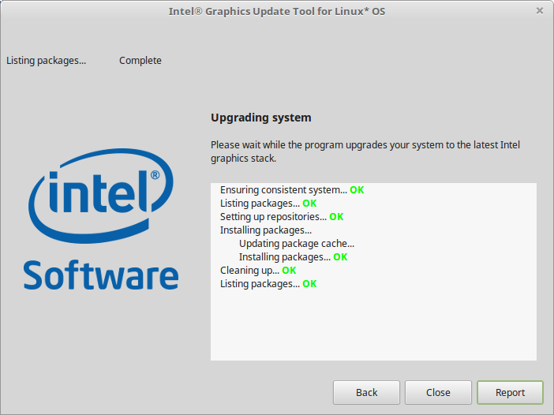
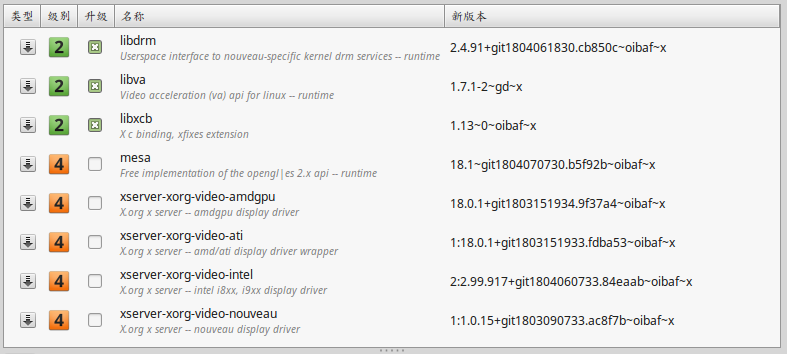

备注：这是Linux Mint 18下的内容，Linux Mint 19尚未更新，按说19的内核版本已经是4.15了，应该不会有这些问题。

虽说　linux mint 默认自带了 intel 集成显卡驱动，不过从实际使用情况看，这个驱动在节能方面表现应该不好。对比 windows 系统，在发热和续航时间上差距明显。

一般的intel集成显卡，可以采用常规方式，使用intel graphics update tool进行驱动安装。对于新一点的硬件，比如7代和8代cpu集成的hd 630等intel显卡的安装则更复杂一些。

> 备注： 验证过8代cpu i7 8700带的HD 630显卡（代号i915）必须通过第二种方式安装，intel graphics update tool完全无效。

## 常规方式：使用intel graphics update tool

官方会指向下面的开源社区网站，支持 ubuntu 16.04 的最新驱动是　v2.0.2　:

https://01.org/zh/linuxgraphics/downloads/intel-graphics-update-tool-linux-os-v2.0.2

下载64位版本　`intel-graphics-update-tool_2.0.2_amd64.deb`。

> 注：这个网站最近报错无法访问。

或者从这里下载：

https://download.01.org/gfx/ubuntu/16.04/main/pool/main/i/intel-graphics-update-tool/

### 安装intel graphics update tool

linux mint　在安装 intel 更新工具时，需要修改发行版本的信息，否者会无法安装。参考下文:

https://unix.stackexchange.com/questions/315049/cannot-install-intel-graphics-driver-on-linux-mint-18

修改修改　`/etc/lsb-release` 文件，将 linuxmint 信息修改回　ubuntu：

```bash
#DISTRIB_ID=LinuxMint
#DISTRIB_RELEASE=18
#DISTRIB_CODENAME=sarah
#DISTRIB_DESCRIPTION="Linux Mint 18 Sarah"
DISTRIB_ID=Ubuntu
DISTRIB_RELEASE=16.04
DISTRIB_CODENAME=xenial
DISTRIB_DESCRIPTION="Ubuntu 16.04 LTS"
```

保存后退出。然后更新。

```bash
sudo apt-get update
```

然后继续安装。安装完成之后再将　`/etc/lsb-release` 文件恢复：

```bash
DISTRIB_ID=LinuxMint
DISTRIB_RELEASE=18
DISTRIB_CODENAME=sarah
DISTRIB_DESCRIPTION="Linux Mint 18 Sarah"
#DISTRIB_ID=Ubuntu
#DISTRIB_RELEASE=16.04
#DISTRIB_CODENAME=xenial
#DISTRIB_DESCRIPTION="Ubuntu 16.04 LTS"
```

### 更新系统

```bash
wget --no-check-certificate https://download.01.org/gfx/RPM-GPG-KEY-ilg-4 -O - | sudo apt-key add -
sudo apt update && sudo apt full-upgrade
```

### 安装驱动

在应用中找到 intel update tool，开始安装。

> 备注：如果遇到网络问题，尝试翻墙



## 开源

以下以Linux Mint 18.3为例，安装intel 8代CPU i7 8700自带的intel hd 630显卡驱动。步骤如下：

1. 安装操作系统之后，进入桌面系统提示当前处于软件渲染，性能不好，cpu占用高。然后会发现显卡驱动没有安装，屏幕分辨率无法设置。
2. 首先，更新系统，通过更新管理器，将可以更新的内容都更新下来，包括linux kernel
3. 特别注意linux kernel的选择

	* Linux mint 18.3默认带的linux内核是4.10，这个内核是无法支持hd 630的，必须更新。
	* 用更新管理器更新下来的内核是linux 4.13.38，这个是ubuntu 17.10版本使用的内核，比较稳定。

	* 用更新管理器列出可选内核时，还会看到非常新的4.15内核。这个内核验证过，如果没有更新intel显卡驱动就直接安装，会在启动时黑屏无法使用。在用下面的方式安装好驱动之后，可以正常工作。不过4.15内核实在太新，为了避免麻烦，还是建议选择比较稳定的4.13.38内核。

4. 重启机器，此时使用的内核版本是4.13.38
5. 添加ppa仓库

	```bash
	sudo add-apt-repository ppa:oibaf/graphics-drivers
	sudo apt-get update
	```

6. 再次使用更新管理器，此时刷新后会看到有新的可更新内容：

	

	选择全部进行安装。

7. 设置Grub参数，增加"i915.alpha_support=1"

	设置的方式有两种，可以手工通过命令行设置：

	打开`/etc/default/grub`, 找到`GRUB_CMDLINE_LINUX_DEFAULT="quiet splash"`这行，修改为`GRUB_CMDLINE_LINUX_DEFAULT="i915.alpha_support=1 quiet splash"`, 保存。然后执行`sudo update-grub`命令让参数生效。

	也可以通过Grub Customizer这个图形工具来设置：

	首先安装grub-customizer：

    ```bash
    sudo add-apt-repository ppa:danielrichter2007/grub-customizer
    sudo apt update
    sudo apt install grub-customizer
    ```

	然后启动grub customizer，在General tab下，找到Kernel Parameters，加入`i915.alpha_support=1`，保存即可。

	

8. 重新启动，此时显卡驱动就应该安装完成可以使用了。

### 备注

从安装的过程看，这个方式应该也可以用来安装amd和ati显卡驱动，后续有机会再试试。

从简单好用来说，linux下使用nvidia显卡是最省事省心的方案。
